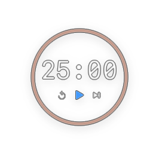
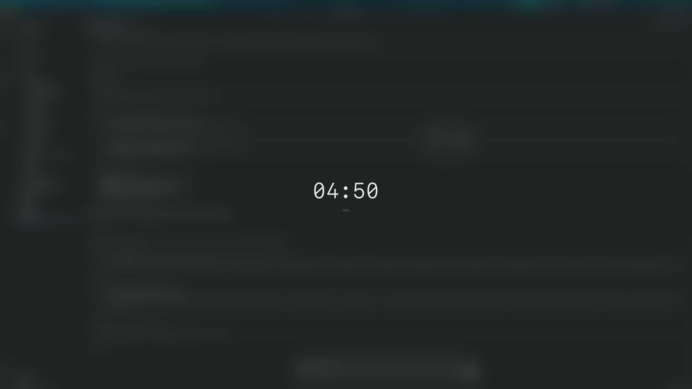

# PomodoroTimer

> A minimal, silent, native macOS Pomodoro timer that stays out of your way.

<p align="center">
  
</p>

<p align="center">
  
  
  
</p>

---

## Overview

Most Pomodoro apps interrupt you — with sounds, banners, badges, and popups. This one doesn't.

A small transparent panel floats silently over your work, showing a circular ring and countdown. No noise. No notifications. No Dock icon. When a focus session ends, a full-screen blur quietly covers every display, giving your eyes a real break before automatically moving on. Everything is designed to be felt, not noticed.

---

## Features

**Timer**
- Three phases: **Focus** (25 min) → **Short Break** (5 min) → **Long Break** (15 min) — all durations configurable
- Automatic phase cycling: long break every N focus sessions (default 4)
- Start / Pause / Skip / Reset from the panel or menu bar dropdown
- Sessions advance automatically when a phase ends — on by default, can be disabled

**Floating Panel**
- Transparent, always-on-top window — no title bar, no Dock icon
- Circular progress ring color-coded by phase (warm brown / sage green / slate blue)
- Large monospaced countdown in the center
- X button fades in on hover; drag anywhere to reposition; position saved across launches

**Forced Break Screen**
- Full-screen blurred overlay covers every connected display when a focus session ends — on by default, can be disabled in Settings → Timer
- Shows only the break countdown — no distractions
- **Skip** button immediately dismisses the overlay and starts the next focus session

<p align="center">
  
</p>

**Menu Bar**
- Timer icon + remaining time always visible
- Dropdown: current phase, time remaining, Start / Pause / Reset / Skip
- Quick links: Open Panel · Settings · Quit

**Global Hotkeys**

| Action | Default |
|---|---|
| Start / Pause | `⌃P` |
| Skip | `⌃⇧S` |
| Reset | `⌃R` |
| Show / Hide Panel | `⌃⌥P` |

Work system-wide regardless of focused app. Configurable in Settings → Shortcuts.

---

## Requirements

- macOS 15.0+
- Xcode 16+
- [XcodeGen](https://github.com/yonaskolb/XcodeGen) — `brew install xcodegen`

---

## Install

```bash
make install
```

Builds a Release binary, copies it to `/Applications/`, and launches the app.

```bash
make uninstall   # remove from /Applications
```

## Build from Source

```bash
xcodegen generate
open PomodoroTimer.xcodeproj   # then ⌘R in Xcode
```

## Run Tests

```bash
xcodebuild test -scheme PomodoroTimer -destination 'platform=macOS'
```

26 unit tests cover `TimerEngine` (cycle logic, state transitions, sleep/wake, snapshot persistence) and `PersistenceService` (JSON roundtrips, atomic writes, CSV export).

---

## Settings Reference

### Timer tab
| Setting | Range | Default |
|---|---|---|
| Focus duration | 5–90 min | 25 min |
| Short break | 1–30 min | 5 min |
| Long break | 5–60 min | 15 min |
| Long break after N sessions | 2–8 | 4 |
| Start breaks automatically | on/off | **on** |
| Start focus automatically | on/off | **on** |
| Cover screen at end of focus session | on/off | **on** |

### Shortcuts tab
Displays current key bindings. Edit `hotkeyStartPause`, `hotkeySkip`, `hotkeyReset`, `hotkeyTogglePanel` directly in `settings.json` if needed (Carbon key code + modifier flags).

### Appearance tab
System / Light / Dark theme selector.

---

## Data & Privacy

All data is stored locally — no network calls, no telemetry.

| File | Location |
|---|---|
| `settings.json` | `~/Library/Application Support/com.koki.PomodoroTimer/` |
| `timer_snapshot.json` | same |

Timer state is saved on quit and restored on next launch. Atomic writes prevent data corruption.

---

## Architecture

```
PomodoroTimer/
  App/                      — @main entry, AppDelegate (wires everything)
  Models/                   — AppSettings, TimerState enums, Session, TimerSnapshot
  Core/
    TimerEngine/            — TimerEngine (date-diff countdown), SessionCycle (phase logic)
    Services/               — PersistenceService, HotkeyService (Carbon), SleepWakeObserver
  ViewModels/               — TimerViewModel, SettingsViewModel
  WindowControllers/        — MenuBarController, MainPanelController,
                              BreakOverlayController, SettingsWindowController
  Views/
    MainPanel/              — MainPanelView (ring + controls)
    BreakOverlay/           — BreakOverlayView (countdown + skip)
    MenuBar/                — MenuBarInfoView (dropdown content)
    Settings/               — SettingsView + Timer, Shortcuts, Appearance tabs
  Utilities/                — TimeFormatter
  Resources/                — Info.plist, entitlements, Assets.xcassets
PomodoroTimerTests/         — 26 unit tests
```

**Timer accuracy** — stores the wall-clock start time and computes `remaining = remainingAtRunStart − elapsed` on each 0.5 s tick. Immune to CPU throttling, RunLoop stalls, and system sleep.

**Break overlay** — `BreakOverlayController` iterates `NSScreen.screens` and creates one borderless `NSWindow` per display at `.screenSaverWindowLevel`. Windows are rebuilt on every `show()` so display configuration changes are always reflected.

**Global hotkeys** — Carbon `RegisterEventHotKey` API. Requires App Sandbox disabled (`ENABLE_APP_SANDBOX: NO`).

**Observable pattern** — `@Observable` (Swift Observation framework) throughout. `@MainActor` on all services and view models.

---

## License

MIT — see [LICENSE](LICENSE).
